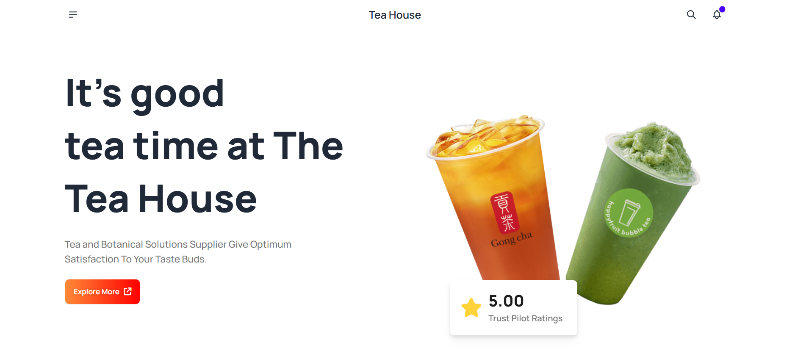

# 🍵 Tea House – Landing Page

**Tea House** is a responsive tea shop landing page built with **HTML**, **Tailwind CSS**, and **DaisyUI**. It's designed to showcase premium teas and promote the shop's products and services. Visitors can explore featured teas, learn about events, and enjoy a smooth user experience across all devices.

[🔗 Live Demo](https://devo-ab.github.io/tea-house)

---

## 🛠️ Tech Stack

- **HTML5**
- **Tailwind CSS**
- **DaisyUI**

---

## 🌟 Features

- ✅ Fully responsive design
- ✅ Elegant navigation bar
- ✅ Engaging banner/hero section
- ✅ Featured Tea Products
- ✅ “Great Tea” info section
- ✅ Super Client Testimonials
- ✅ News & Event Section
- ✅ Informative footer with links

---

---

## 📁 Folder Structure

```
tea-house/
├── assets/
│   ├── icons/              # Icon assets
│   ├── images/             # Website images
│   ├── person/             # Person files
├── preview/                # Screenshots for README
├── index.html              # Main landing page
└── README.md               # Project documentation
└── tailwind.config.js      # Tailwind config
```

---

## 🖼️ Screenshots

### 🧭 Hero Banner & Navbar



###  Featured Products 


### 👣 Full page preview


---

## 📲 How to Use Locally

1. **Clone the repo**
   ```bash
   git clone https://github.com/devo-ab/tea-house.git
   cd tea-house
   ```

# 👤 Author

# Avi Jit

## :mailbox: Reach me out

<p align="left">
<a href="https://linkedin.com/in/itsavijitb" target="blank"></a>
<a href="https://twitter.com/itsavijitb" target="blank"></a>
<a href="https://facebook.com/itsavijitb" target="blank"></a>
<a href="https://instagram.com/itsavijitb" target="blank"></a>
</p>
